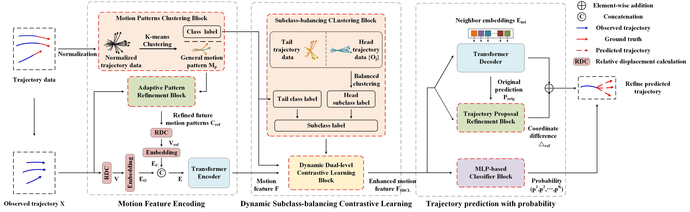
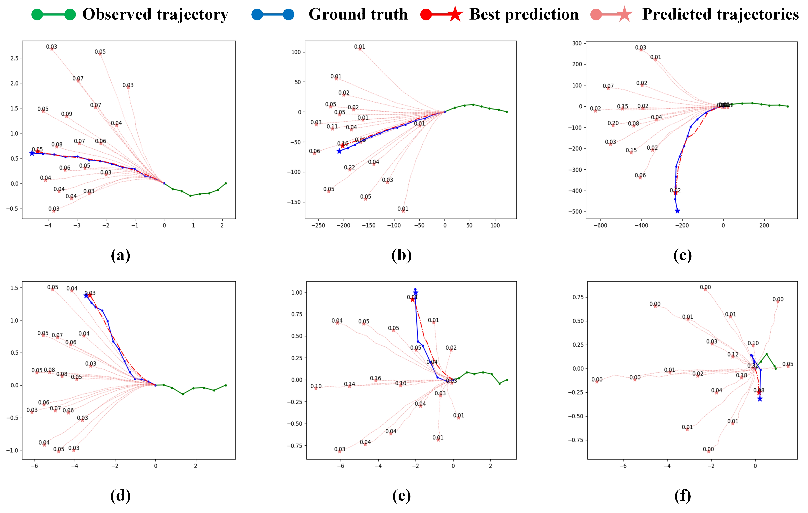

# DSBCL-PRM
# Introduction

    
     
    
Overview of DSBCL-PRM.

    
     
    
trajectory prediction visualization.

    
     
    
visualization.

# Acknowledgement
Our code builds upon [TUTR](https://github.com/lssiair/TUTR). We appreciate all the contributors for their awesome work.
